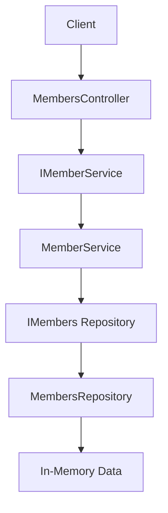

📄 ✅ README.md (Use this)
# 🚀 Member API - ASP.NET Core with Clean Structure & Unit Testing

## 📌 Overview
This project is a simple ASP.NET Core Web API built to demonstrate:
- Clean layered architecture (Controller → Service → Repository)
- Dependency Injection
- Async programming
- Unit Testing using xUnit and Moq

It is designed as a **learning + interview-ready project** showcasing backend fundamentals.

---

## 🧱 Architecture

The application follows a layered approach:

- **Controller Layer** → Handles HTTP requests/responses  
- **Service Layer** → Contains business logic  
- **Repository Layer** → Handles data access  
- **Model Layer** → Represents domain entities  

---

## 🔄 Request Flow

Client → Controller → Service → Repository → Data Source → Response

---

## 📁 Project Structure

MemberSolution/
├── MemberApi/
│ ├── Controllers/
│ ├── Models/
│ ├── Interfaces/
│ ├── Repositories/
│ ├── Services/
│ ├── Program.cs
│
├── MemberApi.Tests/
│ ├── Services/
│ │ └── MemberServiceTests.cs

---

## 🧩 Features

- RESTful API endpoints
- In-memory data store (for demo)
- Service layer abstraction
- Dependency Injection
- Swagger integration
- Unit testing with Moq

---

## 📌 API Endpoints

| Method | Endpoint | Description |
|--------|--------|------------|
| GET | `/api/members` | Get all members |
| GET | `/api/members/{id}` | Get member by ID |

---

## ⚙️ Technologies Used

- ASP.NET Core Web API
- C#
- xUnit
- Moq
- Swagger (OpenAPI)

---

## 🧪 Unit Testing

Unit tests are written for the **Service layer** using:
- Mocked repository (Moq)
- Arrange-Act-Assert pattern

### Example:
mockRepo.Setup(x => x.GetAllMembers())
        .Returns(testData);

## 🧠 Key Concepts Demonstrated
- Repository Pattern
- Service Layer Abstraction
- Dependency Injection (Scoped)
- Async Programming
- Unit Testing & Mocking
## ⚠️ Current Limitations
- Uses in-memory data (no database)
No authentication/authorization
- No logging or validation
- No DTO layer
## 🚀 Future Enhancements
- Add EF Core + SQL Server
- Implement DTO + AutoMapper
- Add JWT Authentication
- Add Logging & Exception Middleware
- Integration Testing
## ▶️ How to Run
dotnet run

Open Swagger:
https://localhost:5000/swagger

---

# 🧭 ✅ Architecture Diagram (BEST for README)

## 🔷 Mermaid Diagram |  🏗️ Architecture Diagram

## 🎤 Interview Talking Points
- Clean separation of concerns
- Testable architecture using DI
- Unit testing with mocked dependencies
- Layered API design

##👨‍💻 Author
Prashant Gupta
